## Hi there 👋

I am Abdellatif EL MIZEB. Web developer from France and currently working as a Fullstack developer. Despite working in the backend, I am very much enthusiastic about frontend technologies. My expertise includes PHP, Magento, Drupal, JavaScript, Nuxt, Vue, MySQL, Android, Flutter, Strapi. Additionally, I like to contribute to the open source community.

✋ Follow Me — My Bot Will Follow You Back! Let’s grow together and support each other’s projects! 🚀

## Tech Stack 💫

## Reach Me 💡
Feel free to contact me :

  
  <!---->
  

## Github Profile Summary Card 💳

  

## GitHub Stats 📟

 

 
 

  

  

<!--
**aelmizeb/aelmizeb** is a ✨ _special_ ✨ repository because its `README.md` (this file) appears on your GitHub profile.

Here are some ideas to get you started:

- 🔭 I’m currently working on ...
- 🌱 I’m currently learning ...
- 👯 I’m looking to collaborate on ...
- 🤔 I’m looking for help with ...
- 💬 Ask me about ...
- 📫 How to reach me: ...
- 😄 Pronouns: ...
- ⚡ Fun fact: ...
-->
